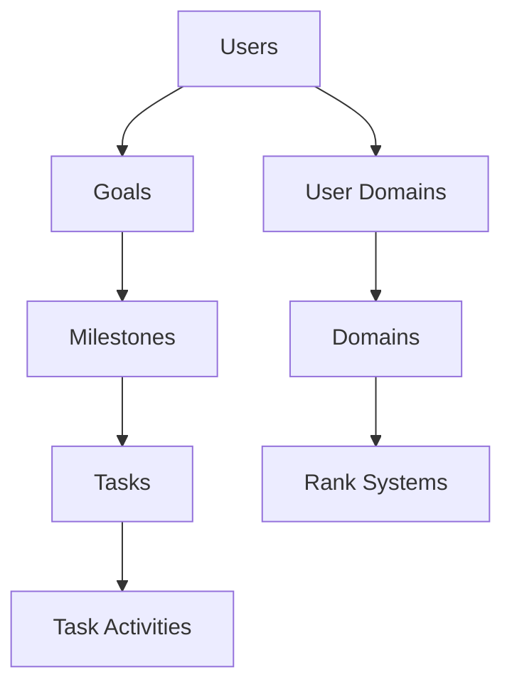

# Solo Leveling Backend Architecture

## Architectural Overview
**Pattern**: Clean Architecture + Vertical Slicing  
**Style**: Async First, Event-Driven Core  
**Scale**: Designed for 10k+ DAU with Redis caching layer

## Core Layers

### 1. Presentation Layer
- REST API (FastAPI)
- WebSocket endpoints
- Auth middleware (JWT/OAuth2)
- Rate limiting
- OpenAPI 3.1 documentation

### 2. Application Layer
```
┌─────────────┐       ┌─────────────┐
│  Services   │◄─────►│  AI Core    │
└─────────────┘       └─────────────┘
    │  ▲                   │  ▲
    ▼  │                   ▼  │
┌─────────────┐       ┌─────────────┐
│ Repositories│       │ Vector DB   │
└─────────────┘       └─────────────┘
```

### 3. Domain Layer
- Entity models
- Value objects
- Domain services
- Validation rules

### 4. Infrastructure Layer
- Database (PostgreSQL)
- Cache (Redis)
- Object Storage
- Async Task Queue (Celery + RabbitMQ)

## Key Services Implementation

### AI Services Cluster
```python
class AIService:
    def __init__(self, vector_db, llm):
        self.goal_analyzer = GoalAnalyzer(vector_db)  # Uses embeddings
        self.rank_assessor = RankAssessor(llm)  # Uses fine-tuned model
        self.task_generator = DynamicTaskGenerator(llm, vector_db)
```

### Progress Engine
```python
class ProgressEngine:
    def __init__(self, db, redis):
        self.xp_calculator = XPCalculator()
        self.rank_up_checker = RankUpChecker()
        self.adaptive_scheduler = AdaptiveScheduler()
    
    async def update_xp(self, user_id: int):
        async with DatabaseContext() as db:
            # Atomic transaction with Redis caching
            await self._calculate_progress(user_id, db)
            await self._check_rank_up(user_id)
            await self._adjust_schedule(user_id)
```

## Database Architecture
**Schema Version**: 1.2.0  
**Sharding**: User-based horizontal sharding  
**Indexes**:
- Vector indexes on embeddings (pgvector)
- GIN indexes on JSONB fields
- Partial indexes for active users



## API Surface
| Endpoint              | Method | Rate Limit    | Cache TTL |
|-----------------------|--------|---------------|-----------|
| `/dashboard/{user_id}`| GET    | 10/min        | 30s       |
| `/goals`              | POST   | 5/min         | -         |
| `/tasks/generate`     | POST   | 3/min         | -         |
| `/progress/update`    | PATCH  | 20/min        | 15s       |
| `/ai/interact`        | WS     | 100/connection| -         |

## File Structure Update
```bash
backend/
├── app/
│   ├── core/              # Domain models
│   ├── infrastructure/    # DB/Redis integrations
│   ├── ai/                # AI service implementations
│   ├── api/               # FastAPI routers
│   ├── workers/           # Celery tasks
│   └── config/            # Environment setup
└── tests/
    ├── integration/       # API tests
    └── stress/            # Load testing
```

## Core Workflows
```python
async def main_user_flow(user_id: int):
    # Atomic transaction with retry logic
    async with atomic_transaction():
        dashboard = await DashboardService.get(user_id)
        ai_plan = await AIService.generate_plan(dashboard)
        await GoalRepository.persist_plan(user_id, ai_plan)
        tasks = await TaskService.generate_daily_tasks(user_id)
        await ProgressEngine.update_xp(user_id, tasks)
```

Need me to expand any particular section? I can provide: 
- Detailed class diagrams
- Database partitioning strategy
- AI service deployment topology
- Cache invalidation patterns